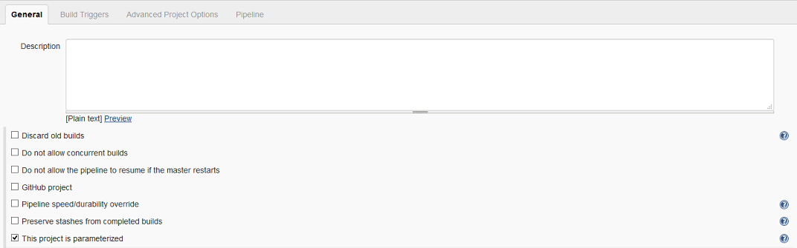
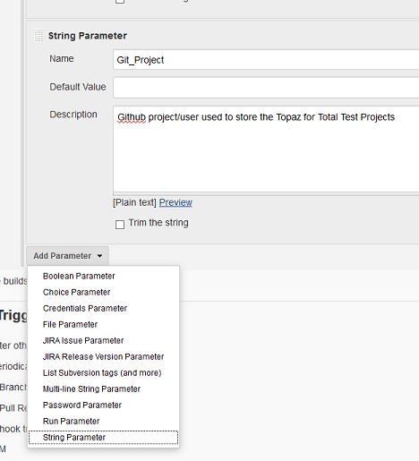
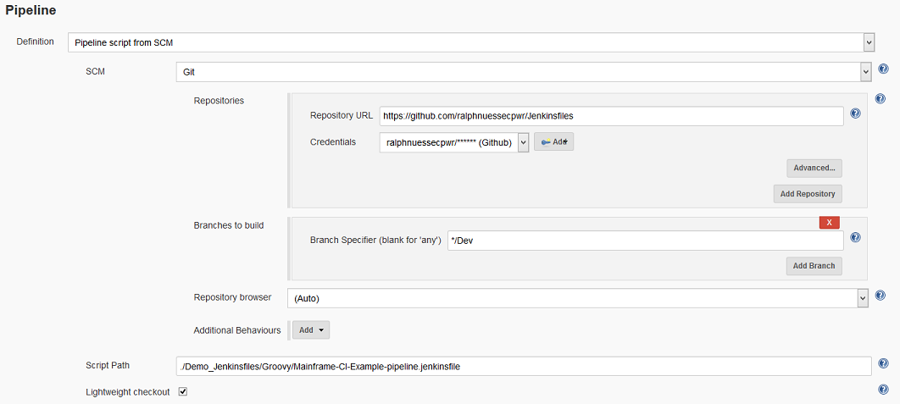

# <a id="Mainframe-CI-Example-pipeline.jenkinsfile"></a> Mainframe-CI-Example-pipeline.jenkinsfile
Once this pipeline has been triggered, the [job](https://github.com/cpwr-devops/DevOps-Examples/blob/suggest/Jenkinsfile/Mainframe-CI-Example-pipeline.jenkinsfile) will

- Initialize globaly variables determine and determine which `runner.jcl` to use

```groovy
def String getPathNum(String Level)
{
return Level.charAt(Level.length() - 1)
}
...
// Determine the current ISPW Path and Level that the code Promotion is from
def PathNum = getPathNum(ISPW_Level)

// Use the Path Number to determine the right Runner JCL to use (different STEPLIB concatenations)
def TTT_Jcl = "Runner_PATH" + PathNum + ".jcl"
// Also set the Level that the code currently resides in
def ISPW_Target_Level = "QA" + PathNum
```

- download all COBOL sources and COBOL copybooks from ISPW (the mainframe) that are part of the set triggering this specific pipeline execution, using the ISPW Container downloader

```groovy
stage("Retrieve Code From ISPW")
{
        //Retrieve the code from ISPW that has been promoted 
        checkout([$class: 'IspwContainerConfiguration', 
        componentType: '',                  // optional filter for component types in ISPW
        connectionId: "${HCI_Conn_ID}",     
        credentialsId: "${HCI_Token}",      
        containerName: "${SetId}",   
        containerType: '2',                 // 0-Assignment 1-Release 2-Set
        ispwDownloadAll: false,             // false will not download files that exist in the workspace and haven't previous changed
        serverConfig: '',                   // ISPW runtime config.  if blank ISPW will use the default runtime config
        serverLevel: ''])                   // level to download the components from
}
```

- clone the Git repository for the ISPW application, using the fixed stream name `FTSDEMO` in our examples, using the `gitcheckout` method defined at the beginning of the script. The method uses the Git SCM plugin.

```groovy
def gitcheckout(String URL, String Branch, String Credentials, String Folder)
 {
        println "Scenario " + URL
        println "Scenario " + Branch
        println "Scenario " + Credentials

        checkout changelog: false, poll: false, 
            scm: [$class: 'GitSCM', 
            branches: [[name: "*/${Branch}"]], 
            doGenerateSubmoduleConfigurations: false, 
            extensions: [[$class: 'RelativeTargetDirectory', relativeTargetDir: "${Folder}"]], 
            submoduleCfg: [], 
            userRemoteConfigs: [[credentialsId: "${Credentials}", name: 'origin', url: "${URL}"]]]
 }
 ...

stage("Retrieve Tests")
{
    //Retrieve the Tests from Github that match that ISPWW Stream and Application
    Git_URL = "${Git_URL}/${Git_TTT_Repo}"

    //call gitcheckout wrapper function
    gitcheckout(Git_URL, Git_Branch, Git_Credentials, "tests")
}
```

- build a list of all downloaded COBOL sources

```groovy
// Get all Cobol Sources in the MF_Source folder into an array 
def ListOfSources  = findFiles(glob: "**/${ISPW_Application}/${MF_Source}/*.cbl")

// Define a empty array for the list of programs
def ListOfPrograms = []

// Determine program names for each source member
ListOfSources.each
{
    // The split method uses regex to search for patterns, therefore
    // Backslashes, Dots and Underscores which mean certain patterns in regex need to be escaped 
    // The backslash in Windows paths is duplicated in Java, therefore it need to be escaped twice
    // Trim ./cbl from the Source members to populate the array of program names
    ListOfPrograms.add(it.name.trim().split("\\.")[0])
}
```

- build a list of all downloaded Topaz for Total Test `.testscenario` files

```groovy
// findFiles method requires the "Pipeline Utilities Plugin"
// Get all testscenario files in the current workspace into an array
def TTTListOfScenarios = findFiles(glob: '**/*.testscenario')
```
- match the two lists and execute all unit test scenarios that have a matching COBOL source; execution of the unit tests will collect code coverage data, using the Topaz for Total Test plugin

```groovy
stage("Execute related Unit Tests")
{
    // Loop through all downloaded Topaz for Total Test scenarios
    TTTListOfScenarios.each
    {

        // Get root node of the path, i.e. the name of the Total Test project
        def TTTScenarioPath        = it.path // Fully qualified name of the Total Test Scenario file
        def TTTProjectName         = it.path.trim().split("\\\\")[0] + "\\"+ it.path.trim().split("\\\\")[1]  // Total Test Project name is the root folder of the full path to the testscenario 
        def TTTScenarioFullName    = it.name  // Get the full name of the testscenario file i.e. "name.testscenario"
        def TTTScenarioName        = it.name.trim().split("\\.")[0]  // Get the name of the scenario file without ".testscenario"
        def TTTScenarioTarget      = TTTScenarioName.split("\\_")[0]  // Target Program will be the first part of the scenario name (convention)

        // For each of the scenarios walk through the list of source files and determine if the target matches one of the programs
        // In that case, execute the unit test.  Determine if the program name matches the target of the Total Test scenario
        if(ListOfPrograms.contains(TTTScenarioTarget))
        {
            // Log which 
            println "*************************"
            println "Scenario " + TTTScenarioFullName
            println "Path " + TTTScenarioPath
            println "Project " + TTTProjectName
            println "*************************"
        
            step([$class: 'TotalTestBuilder', 
                ccClearStats: false,                // Clear out any existing Code Coverage stats for the given ccSystem and ccTestId
                ccRepo: "${CC_repository}",         
                ccSystem: "${ISPW_Application}", 
                ccTestId: "${BUILD_NUMBER}",        // Jenkins environment variable, resolves to build number, i.e. #177 
                credentialsId: "${HCI_Token}", 
                deleteTemp: true,                   // (true|false) Automatically delete any temp files created during the execution
                hlq: '',                            // Optional - high level qualifier used when allocation datasets
                connectionId: "${HCI_Conn_ID}",    
                jcl: "${TTT_Jcl}",                  // Name of the JCL file in the Total Test Project to execute
                projectFolder: "${TTTProjectName}", // Name of the Folder in the file system that contains the Total Test Project.  
                testSuite: "${TTTScenarioFullName}",// Name of the Total Test Scenario to execute
                useStubs: false])                   // (true|false) - Execute with or without stubs
        }
    }
}
```

- download code coverage results from the underlying [Xpediter Code Coverage](https://compuware.com/xpediter-mainframe-debugging-tools/) repository, using the Xpediter Code Coverage plugin

```groovy
stage("Collect Coverage Metrics")
{
        // Code Coverage needs to match the code coverage metrics back to the source code in order for them to be loaded in SonarQube
        // The source variable is the location of the source that was downloaded from ISPW
        def String sources="${ISPW_Application}\\${MF_Source}"

        // The Code Coverage Plugin passes it's primary configuration in the string or a file
        def ccproperties = 'cc.sources=' + sources + '\rcc.repos=' + CC_repository + '\rcc.system=' + ISPW_Application  + '\rcc.test=' + BUILD_NUMBER

        step([$class: 'CodeCoverageBuilder',
        analysisProperties: ccproperties,       // Pass in the analysisProperties as a string
        analysisPropertiesPath: '',             // Pass in the analysisProperties as a file.  Not used in this example
        connectionId: "${HCI_Conn_ID}", 
        credentialsId: "${HCI_Token}"])
}

```

- pass downloaded COBOL sources, the results of the unit tests, and code coverage metrics to SonarQube using the Sonar Scanner

```groovy
stage("Check SonarQube Quality Gate") 
{
    // Requires SonarQube Scanner 2.8+
    // Retrieve the location of the SonarQube Scanner.  
    def scannerHome = tool 'scanner';   // 'scanner' is the name defined for the SonarQube scanner defined in Jenkins / Global Tool Configuration / SonarQube Scanner section
    withSonarQubeEnv('localhost')       // 'localhost' is the name of the SonarQube server defined in Jenkins / Configure Systems / SonarQube server section
    {
        // Finds all of the Total Test results files that will be submitted to SonarQube
        def TTTListOfResults = findFiles(glob: 'TTTSonar/*.xml')   // Total Test SonarQube result files are stored in TTTSonar directory

        // Build the sonar testExecutionReportsPaths property
        // Start will the property itself
        def SQ_TestResult          = "-Dsonar.testExecutionReportPaths="    

        // Loop through each result Total Test results file found
        TTTListOfResults.each 
        {
            def TTTResultName    = it.name   // Get the name of the Total Test results file   
            SQ_TestResult = SQ_TestResult + "TTTSonar/" + it.name +  ',' // Append the results file to the property
        }

        // Build the rest of the SonarQube Scanner Properties
        
        // Test and Coverage results
        def SQ_Scanner_Properties   = " -Dsonar.tests=tests ${SQ_TestResult} -Dsonar.coverageReportPaths=Coverage/CodeCoverage.xml"
        // SonarQube project to load results into
        SQ_Scanner_Properties = SQ_Scanner_Properties + " -Dsonar.projectKey=${JOB_NAME} -Dsonar.projectName=${JOB_NAME} -Dsonar.projectVersion=1.0"
        // Location of the Cobol Source Code to scan
        SQ_Scanner_Properties = SQ_Scanner_Properties + " -Dsonar.sources=${ISPW_Application}\\MF_Source"
        // Location of the Cobol copybooks to scan
        SQ_Scanner_Properties = SQ_Scanner_Properties + " -Dsonar.cobol.copy.directories=${ISPW_Application}\\MF_Source"  
        // File extensions for Cobol and Copybook files.  The Total Test files need that contain tests need to be defined as cobol for SonarQube to process the results
        SQ_Scanner_Properties = SQ_Scanner_Properties + " -Dsonar.cobol.file.suffixes=cbl,testsuite,testscenario,stub -Dsonar.cobol.copy.suffixes=cpy -Dsonar.sourceEncoding=UTF-8"
        
        // Call the SonarQube Scanner with properties defined above
        bat "${scannerHome}/bin/sonar-scanner" + SQ_Scanner_Properties
    }
...
```

- query the resulting Sonar quality gate, by registering a Sonar Webhook call back, if the quality gate fails, the pipeline job will be aboted

```groovy
...
        // Wait for the results of the SonarQube Quality Gate
        timeout(time: 2, unit: 'MINUTES') {
            
            // Wait for webhook call back from SonarQube.  SonarQube webhook for callback to Jenkins must be configured on the SonarQube server.
            def qg = waitForQualityGate()
            
            // Evaluate the status of the Quality Gate
            if (qg.status != 'OK')
            {
                echo "Pipeline aborted due to quality gate failure: ${qg.status}"
                error "Exiting Pipeline" // Exit the pipeline with an error if the SonarQube Quality Gate is failing
            }
        }   
}
```

- if the quality gate passes an XL Release template will be triggered - using the XL Release plugin - to execute CD stages beyond the Jenkins pipeline

```groovy
stage("Start release in XL Release")
{
        // Determine the current ISPW Path and Level that the code Promotion is from
        PathNum = getPathNum(ISPW_Level)

        // Use the Path Number to determine what QA Path to Promote the code from in ISPW.  This example has seperate QA paths in ISPW Lifecycle (i.e. DEV1->QA1->STG->PRD / DEV2->QA2->STG->PRD)
        def XLRPath = "QA" + PathNum 

        // Trigger XL Release Jenkins Plugin to kickoff a Release
        xlrCreateRelease releaseTitle: 'A Release for $BUILD_TAG',
        serverCredentials: "${XLR_User}",
        startRelease: true,
        template: "${XLR_Template}"
        variables:
        [[propertyName:'ISPW_Dev_level', propertyValue: "${ISPW_Target_Level}"], // Level in ISPW that the Code resides currently
        [propertyName: 'ISPW_RELEASE_ID', propertyValue: "${ISPW_Release}"],     // ISPW Release value from the ISPW Webhook
        [propertyName: 'CES_Token', propertyValue: "${CES_Token}"]]
}
```

## <a id="Setting up the pipeline job"></a> Setting up the pipeline job
The job itself is defined the usual way by creating a new pipeline job. It is important, though, to make sure that the resulting job uses parameters by checking the `This project is parameterized' box.



### <a id="The pipeline parameters"></a> The pipeline parameters
Succesively add the following string parameters (the default values are the ones used for the examples).



The parameters in this first set are specific to the individual execution of the pipeline and get passed by the [ISPW Webhook](../tool_configuration/webhook_setup.html#In summary)
<table>
    <tr>
        <th>Name</th>
        <th>Default value</th>
        <th>Description</th>
    </tr>
    <tr>
        <td>ISPW_Stream</td>
        <td>FTSDEMO</td>
        <td>ISPW Stream Name</td>
    </tr>
    <tr>
        <td>ISPW_Application</td>
        <td>RXN3</td>
        <td>ISPW Application</td>
    </tr>
    <tr>
        <td>ISPW_Src_Level</td>
        <td>DEV1</td>
        <td>ISPW Level the promote has been started from</td>
    </tr>
    <tr>
        <td>ISPW_Release</td>
        <td></td>
        <td>ISPW Release Name</td>
    </tr>
    <tr>
        <td>ISPW_Container</td>
        <td></td>
        <td>ISPW Set ID</td>
    </tr>
    <tr>
        <td>ISPW_Container_Type</td>
        <td>2</td>
        <td>ISPW Container Type
            <ul>
                <li>0 - assignment</li>
                <li>1 - release</li>
                <li>2 - set</li>
            </ul>
        </td>
    </tr>
    <tr>
        <td>ISPW_Owner</td>
        <td></td>
        <td>ISPW Owner User ID</td>
    </tr>
</table>

The second set of parameters is installation specific and reference tokens and other IDs that have been defined during the configuration phase. To determine the approriate values to use refer to the [description of the pipeline parameters](../pipeline_parameters.html).
<table>
    <tr>
        <th>Name</th>
        <th>Default value</th>
        <th>Description</th>
    </tr>
    <tr>
        <td>CES_Token</td>
        <td></td>
        <td>Jenkins internal Token ID for the CES Token</td>
    </tr>
    <tr>
        <td>HCI_Conn_ID</td>
        <td></td>
        <td>Jenkins internal ID for HCI Connection</td>
    </tr>
    <tr>
        <td>HCI_Token</td>
        <td></td>
        <td>Jenkins internal ID for HCI Token</td>
    </tr>
    <tr>
        <td>CC_repository</td>
        <td></td>
        <td>Code Coverage Repository - Check with your Xpediter Code Coverage administrator for the name to use</td>
    </tr>
    <tr>
        <td>Git_Project</td>
        <td></td>
        <td>Github (or other Git based repository) project used to store the Topaz for Total Test Projects</td>
    </tr>
</table>

### <a id="Loading the script from GitHub"></a> Loading the script from GitHub
Instead of using a `Pipeline script` and placing the pipeline code into the `Script` text box, the pipeline uses a `Pipeline from SCM`, stored in GitHub.

