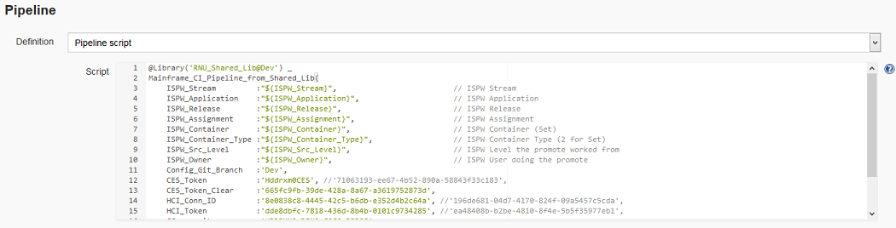

# <a id="Mainframe_CI_Pipeline_from_Shared_Lib"></a> Mainframe_CI_Pipeline_from_Shared_Lib
Being a pipeline from a [shared library](https://jenkins.io/doc/book/pipeline/shared-libraries/) this pipeline must extend a `call` method. This pipeline expects a [`Map`](http://groovy-lang.org/syntax.html#_maps) object, containing the parameters to be passed to the pipeline from the job configuration and trigger.

Once this pipeline has been triggered, the [job](https://github.com/cpwr-devops/DevOps-Examples/blob/suggest/vars/Mainframe_CI_Pipeline_from_Shared_Lib.groovy) will

- Execute its `call` method, within which it will

```groovy
def call(Map pipelineParams)
{
    node
    {
```

- execute its [`initialize`](./code/initialize_method) method to read configuration files and instatiate objects of [helper classes](../helper_classes/helper_classes.html)
    - `PipelineConfig` containing global parameter values that 
        - passed by the job configuration/trigger and are pipeline/execution specific
        - not pipeline or execution specific, like server URLs. These parameters will be read from external configuration files
    - `GitHelper` serving as a wrapper for a set of interactions with Git/GitHub
    - `IspwHelper` serving as a wrapper for use of the ISPW plugins' methods
    - `TttHelper` serving as a wrapper for use of the TTT plugin's and Code Coverage plugin's methods
    - `SonarHelper` serving as a wrapper for use of the Sonar plugins' methods

```groovy
        initialize(pipelineParams)
```

- use the `downloadSources` method of class `IspwHelper` to download all COBOL sources and COBOL copybooks from ISPW (the mainframe) that are part of the set triggering this specific pipeline execution

```groovy
        stage("Retrieve Code From ISPW")
        {
            ispwHelper.downloadSources()
        }
```

- Not always will all required COBOL copybooks be part of an ISPW assignment or set. In order to retrieve any missing copybooks, the next stage will use the `downloadCopyBooks` method of class `ispwHelper` to determine all required copybooks and download them from the mainframe

```groovy
        stage("Retrieve Copy Books From ISPW")
        {
            ispwHelper.downloadCopyBooks("${workspace}")
        }
```

- use the `checkout` method of the `gitHelper`class to clone the Git repository for the ISPW application.  

```groovy
        /* Retrieve the Tests from Github that match that ISPWW Stream and Application */
        stage("Retrieve Tests")
        {            
            def gitUrlFullPath = "${pConfig.gitUrl}/${pConfig.gitTttRepo}"
            
            gitHelper.checkout(gitUrlFullPath, pConfig.gitBranch, pConfig.gitCredentials, pConfig.tttFolder)
        }
 }
```

- Initialize the `TttHelper` instance, loop through the downloaded Topaz for Total Test secnarios, and pass the results to JUnit (within Jenkins) using the methods `initialize`, `loopThruScenarios`, and `passResultsToJunit` of the `TttHelper` class, respectively.

```groovy
        /* 
        This stage executes any Total Test Projects related to the mainframe source that was downloaded
        */ 
        stage("Execute related Unit Tests")
        {
            tttHelper.initialize()                                            
            tttHelper.loopThruScenarios()
            tttHelper.passResultsToJunit()
        }
```

- use the `collectCodeCoverageResults` method of the `TttHelper` class to download the code coveragre metrics from the Xpediter Code Coverage repository

```groovy
        /* 
        This stage retrieve Code Coverage metrics from Xpediter Code Coverage for the test executed in the Pipeline
        */ 
        stage("Collect Coverage Metrics")
        {
            tttHelper.collectCodeCoverageResults()
        }
```

- use the `scan` method of the `SonarHelper` class to pass downloaded COBOL sources, the results of the unit tests, and code coverage metrics to SonarQube

```groovy
        /* 
        This stage pushes the Source Code, Test Metrics and Coverage metrics into SonarQube and then checks the status of the SonarQube Quality Gate.  
        If the SonarQube quality date fails, the Pipeline fails and stops
        */ 
        stage("Check SonarQube Quality Gate") 
        {
            sonarHelper.scan()
...
```

- query the resulting Sonar quality gate, by registering a Sonar Webhook call back, if the quality gate fails, an email will be sent to the owner of the ISPW set - notifying them about the failure of the promote -, and the pipeline job will be aborted

```groovy
...
            // Wait for the results of the SonarQube Quality Gate
            timeout(time: 2, unit: 'MINUTES') {
                
                // Wait for webhook call back from SonarQube.  SonarQube webhook for callback to Jenkins must be configured on the SonarQube server.
                def sonarGate = waitForQualityGate()
                
                // Evaluate the status of the Quality Gate
                if (sonarGate.status != 'OK')
                {
                    echo "Sonar quality gate failure: ${sonarGate.status}"
                    echo "Pipeline will be aborted and ISPW Assignment will be regressed"

                    currentBuild.result = "FAILURE"

                    // Send Standard Email
                    emailext subject:       '$DEFAULT_SUBJECT',
                                body:       '$DEFAULT_CONTENT',
                                replyTo:    '$DEFAULT_REPLYTO',
                                to:         "${pConfig.mailRecipient}"
                    
                    withCredentials([string(credentialsId: pConfig.cesTokenId, variable: 'cesTokenClear')]) 
                    {
                        //ispwHelper.regressAssignmentList(assignmentList, cesTokenClear)
                        ispwHelper.regressAssignment(pConfig.ispwAssignment, cesTokenClear)
                    }

                    error "Exiting Pipeline" // Exit the pipeline with an error if the SonarQube Quality Gate is failing
                }
            }   
        }
```

- if the quality gate passes an XL Release template will be triggered - using the XL Release plugin - to execute CD stages beyond the Jenkins pipeline, and an email will be sent to the owner of the ISPW set - notifying them about the success of the promote

```groovy
        /* 
        This stage triggers a XL Release Pipeline that will move code into the high levels in the ISPW Lifecycle  
        */ 
        stage("Start release in XL Release")
        {
            // Trigger XL Release Jenkins Plugin to kickoff a Release
            xlrCreateRelease(
                releaseTitle:       'A Release for $BUILD_TAG',
                serverCredentials:  "${pConfig.xlrUser}",
                startRelease:       true,
                template:           "${pConfig.xlrTemplate}",
                variables:          [
                                        [propertyName:  'ISPW_Dev_level',   propertyValue: "${pConfig.ispwTargetLevel}"], // Level in ISPW that the Code resides currently
                                        [propertyName:  'ISPW_RELEASE_ID',  propertyValue: "${pConfig.ispwRelease}"],     // ISPW Release value from the ISPW Webhook
                                        [propertyName:  'CES_Token',        propertyValue: "${pConfig.cesTokenId}"]
                                    ]
            )

            // Send Standard Email
            emailext subject:       '$DEFAULT_SUBJECT',
                        body:       '$DEFAULT_CONTENT \n' + 'Promote passed the Quality gate and a new XL Release was started.',
                        replyTo:    '$DEFAULT_REPLYTO',
                        to:         "${pConfig.mailRecipient}"

        }        
    }
}
```

## <a id="Setting up the pipeline job"></a> Setting up the pipeline job
The job itself is defined via the usual way of creating a new pipeline job. It is important, though, to make sure that the resulting job uses parameters by checking the `This project is parameterized` box, 


## <a id="Setting up the pipeline job"></a> Setting up the pipeline job
Succesively add the following string parameters (the default values are the ones used for the examples).


The parameters in this first set are specific to the individual execution of the pipeline and get passed by the [ISPW Webhook](../tool_configurations/webhhok_setup.html#In summary).
<table>
    <tr>
        <th>Name</th>
        <th>Default value</th>
        <th>Description</th>
    </tr>
    <tr>
        <td>ISPW_Stream</td>
        <td>FTSDEMO</td>
        <td>ISPW Stream Name</td>
    </tr>
    <tr>
        <td>ISPW_Application</td>
        <td>RXN3</td>
        <td>ISPW Application</td>
    </tr>
    <tr>
        <td>ISPW_Src_Level</td>
        <td>DEV1</td>
        <td>ISPW Level the promote has been started from</td>
    </tr>
    <tr>
        <td>ISPW_Release</td>
        <td></td>
        <td>ISPW Release Name</td>
    </tr>
    <tr>
        <td>ISPW_Container</td>
        <td></td>
        <td>ISPW Set ID</td>
    </tr>
    <tr>
        <td>ISPW_Container_Type</td>
        <td>2</td>
        <td>ISPW Container Type
            <ul>
                <li>0 - assignment</li>
                <li>1 - release</li>
                <li>2 - set</li>
            </ul>
        </td>
    </tr>
    <tr>
        <td>ISPW_Owner</td>
        <td></td>
        <td>ISPW Owner User ID</td>
    </tr>
</table>


### <a id="Loading the script from a shared library"></a> Loading the script from a shared library
To tell Jenkins to execute a pipeline from a shared library, you need to add code like the follwoing to the Pipeline script definition.



The examle uses

```groovy
@Library('RNU_Shared_Lib@Dev') _
Mainframe_CI_Pipeline_from_Shared_Lib(
    ISPW_Stream         :"${ISPW_Stream}",                          // ISPW Stream               
    ISPW_Application    :"${ISPW_Application}",                     // ISPW Application
    ISPW_Release        :"${ISPW_Release}",                         // ISPW Release
    ISPW_Assignment     :"${ISPW_Assignment}",                      // ISPW Assignment
    ISPW_Container      :"${ISPW_Container}",                       // ISPW Container (Set)
    ISPW_Container_Type :"${ISPW_Container_Type}",                  // ISPW Container Type (2 for Set)
    ISPW_Src_Level      :"${ISPW_Src_Level}",                       // ISPW Level the promote worked from
    ISPW_Owner          :"${ISPW_Owner}",                           // ISPW User doing the promote
    Config_Git_Branch   :'Dev',
    CES_Token           :'xxxx',
    CES_Token_Clear     :'xxxx',    
    HCI_Conn_ID         :'xxxx',
    HCI_Token           :'xxxx', 
    CC_repository       :'xxxx',
    Git_Project         :'xxxx',
    Git_Credentials     :'xxxx' 
    )
```

where

- `@Library('RNU_Shared_Lib@Dev') _`
refers to the name of a [Shared Library](./tool_configuration/Pipeline_libraries_config.html), with `@Dev` in this example referring to the `Dev` branch of the underlying GitHub repository. The trailing `_` is required by Jenkins.
- `Mainframe_CI_Pipeline_from_Shared_Lib`
refers to the name of the `.groovy` file in the `vars` [folder of the GitHub repository](../index.html), containing the pipeline code
- Within the brackets `(...)` parameters are passed to the pipeline script. `Mainframe_CI_Pipeline_from_Shared_Lib` expects a `groovy` [`Map`](http://groovy-lang.org/syntax.html#_maps), containing the following `key:value` pairs. 

The parameters in this first set are specific to the individual execution of the pipeline. The values are the parameters defined in the [pipeline configuration above](#Setting up the pipeline job). The syntax `"${parameter}"` ensures that the value passed to this parameter is taken as value in the `Map`.
<table>
    <tr>
        <th>Key</th>
        <th>Value</th>
        <th>Description</th>
    </tr>
    <tr>
        <td>ISPW_Stream</td>
        <td>"${ISPW_Stream}"</td>
        <td>The ISPW_Stream parameter from the pipeline configuration above</td>
    </tr>
    <tr>
        <td>ISPW_Application</td>
        <td>"${ISPW_Application}"</td>
        <td>The ISPW_Application parameter from the pipeline configuration above</td>
    </tr>
    <tr>
        <td>ISPW_Release</td>
        <td>"${ISPW_Release}"</td>
        <td>The ISPW_Release parameter from the pipeline configuration above</td>
    </tr>
    <tr>
        <td>ISPW_Assignment</td>
        <td>"${ISPW_Assignment}"</td>
        <td>The ISPW_Assignment parameter from the pipeline configuration above</td>
    </tr>
    <tr>
        <td>ISPW_Container</td>
        <td>"${ISPW_Container}"</td>
        <td>The ISPW_Container parameter from the pipeline configuration above</td>
    </tr>
    <tr>
        <td>ISPW_Container_Type</td>
        <td>"${ISPW_Container_Type}"</td>
        <td>The ISPW_Container_Type parameter from the pipeline configuration above</td>
    </tr>
    <tr>
        <td>ISPW_Src_Level</td>
        <td>"${ISPW_Src_Level}"</td>
        <td>The ISPW_Src_Level parameter from the pipeline configuration above</td>
    </tr>
    <tr>
        <td>ISPW_Owner</td>
        <td>"${ISPW_Owner}"</td>
        <td>The ISPW_Owner parameter from the pipeline configuration above</td>
    </tr>
</table>

The second set of parameters is installation specific and reference tokens and other IDs that have been defined during the configuration phase. To determine the approriate values to use refer to the [description of the pipeline parameters](../pipeline_parameters.html).

Usually, these parameters will be installation specific rather than pipeline job or execution specific. Future versions of the example will take care of this, and move these parameters to configuration files.
<table>
    <tr>
        <th>Key</th>
        <th>Value</th>
        <th>Description</th>
    </tr>
    <tr>
        <td>Config_Git_Branch</td>
        <td></td>
        <td>Branch in the Git repository where configuration files are to be read from</td>
    </tr>
    <tr>
        <td>CES_Token</td>
        <td></td>
        <td>The Jenkins token, referring to the CES token</td>
    </tr>
    <tr>
        <td>CES_Token_Clear</td>
        <td></td>
        <td>The "clear text" CES token (as copyied from the <a href="../tool_configuration/CES_credentials_token.html">CES Token dialog</a>)</td>
    </tr>
    <tr>
        <td>HCI_Conn_ID</td>
        <td></td>
        <td>The Jenkins internal ID for the HCI connection to use</td>
    </tr>
    <tr>
        <td>HCI_Token</td>
        <td></td>
        <td>Jenkins internal ID for HCI Token</td>
    </tr>
    <tr>
        <td>CC_repository</td>
        <td></td>
        <td>The Xpediter Code Coverage repository to use</td>
    </tr>
    <tr>
        <td>Git_Project</td>
        <td></td>
        <td>The name of the GitHub repository storing Topaz for Total Test assets</td>
    </tr>
    <tr>
        <td>Git_Credentials</td>
        <td></td>
        <td>Jenkins internal ID for credentials to use the GitHub repository</td>
    </tr>
</table>