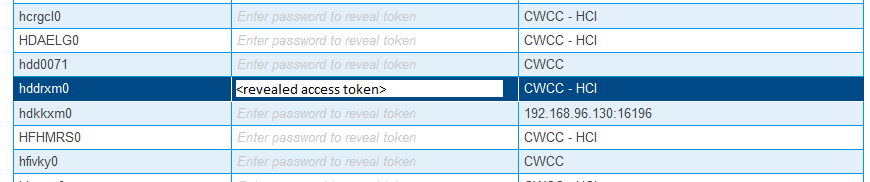

# Definition of CES credentials token
To define a CES credentials token go to the CES **Security** menu. On the **Personal Access Tokens** tab use `add` to create a new token, or select an existing token and use `edit` to modify (update) the stored password or other credentials details.

Select an existing token and enter your current TSO password matching the stored TSO user ID to reveal the credentials token defined for this set of credentials. 

Take note of this access token for further use. This token will remain the same when updating the stored password to a new one.