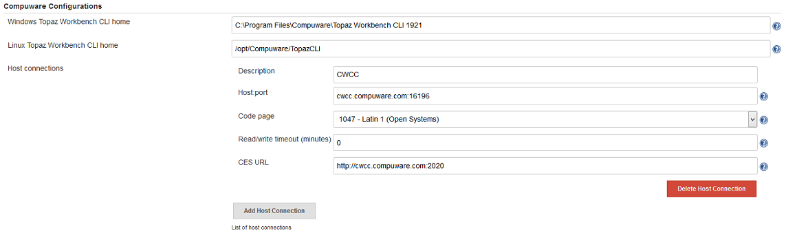
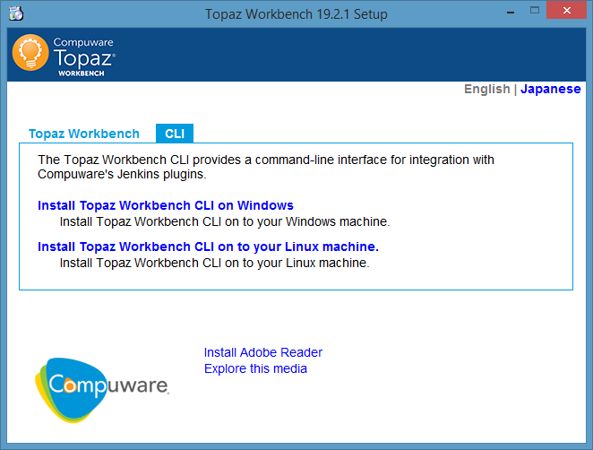

#  Compuware Configurations
In `Manage Jenkins` -> `Configure System`, under the heading **Compuware Configurations** use either the Windows or Linux path fields to point to the location of the Topaz Workbench CLI (Command Line Interface).

Use the `Add Host Connection` button to add new host connection definition (connection to a mainframe LPAR). Use `Description` for name to be used during the scripts. Use `Host:port` to point to the host name of themainframe LPAR to connect to (HCI port), select the required `Code page`, and use `CES URL`to point to the CES to use.

##  Installing the Topaz Workbench CLI
This interface is delivered with the Topaz Workbench full install download and can be installed using the provided setup.exe. In this dialog select the tab `CLI` and select either Windows or Linus installation. 

The CLI must be installed locally to the Jenkins server.
