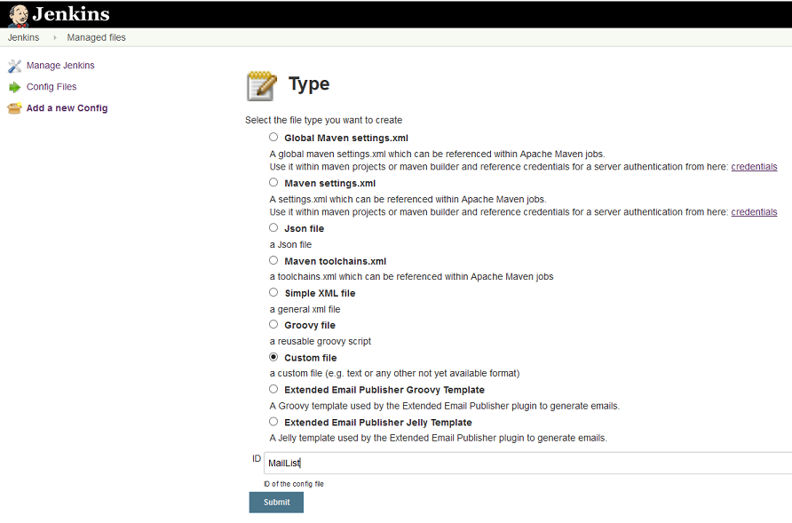
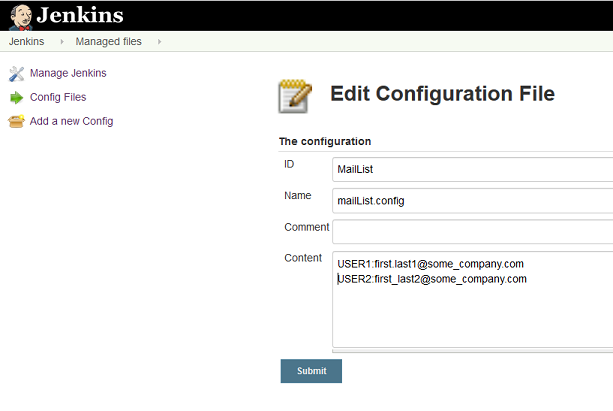

#  Configuration handled by the Config File Provider
In `Manage Jenkins` -> `Managed Files` select `Add a new Config` to add a new configuration file to be handled by this plugin. Once files are created you can select the existing files to review and modify their content.

Configuration files used in the examples are plain text files. Therefore, chose `Custom file` as file type when defining a new file, and provide an ID that is meaningful. The examples use `MailList`as ID:

After `submitting` specify a file name to use and start filling the file with content. 

##  The email list
The example mail list file uses a file name of `mailList.config` and pairs of `<TSO User ID>:<mailaddress>`, each on a seprate line. The TSO user IDs used in this file correspond to the ISPW owner values passed by the [ISPW webhooks](./webhhok_setup.html).

