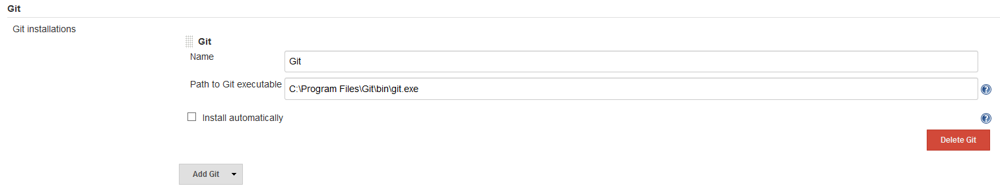

#  Git
In `Manage Jenkins` -> `Global Tool Configuration`, under the heading **Git**** use the `Add Git` button to add a new definition. Use `Path to Git executable` to point to the path to the git.exe local to the Jenkins server and provide a `Name`.

