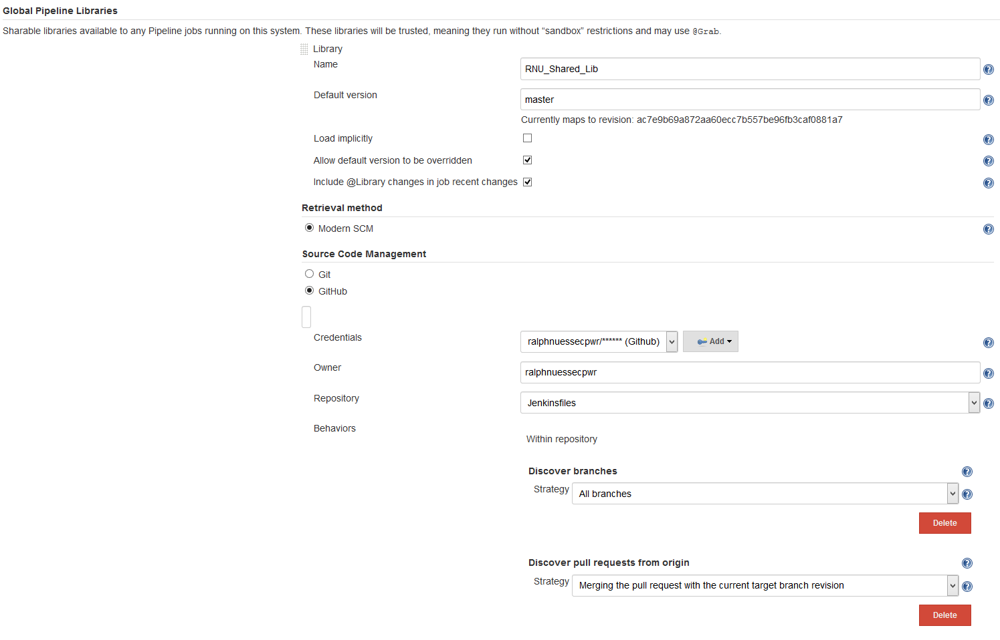

# Global Pipeline Libraries
In `Manage Jenkins` -> `Configure System`, under the heading **Global Pipeline Libraries** use a name for the Shared Library to refer to during pipeline definitions. Use select "Modern SCM" and the matching SCM you use for storing `jenkinsfiles`. The examples use GitHub and use the `master` branch as default branch. This can be overridden during pipeline definition. 

Point to the repository used for storing `jenkinsfiles` and provide the [Git credentials defined elsewhere](./Jenkins_Git_config.md).

