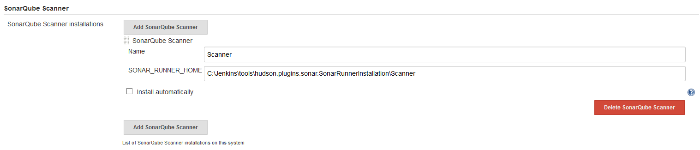

#  SonarQube Scanner
In `Manage Jenkins` -> `Global Tool Configuration`, under the heading **SonarQube Scanner** use the `Add SonarQube Scanner` button to add a new definition. Use `SONAR_RUNNER_HOME` to point to the path to the SonarQube Scanner local to the Jenkins server and provide a `Name` to be used during the scripts.

