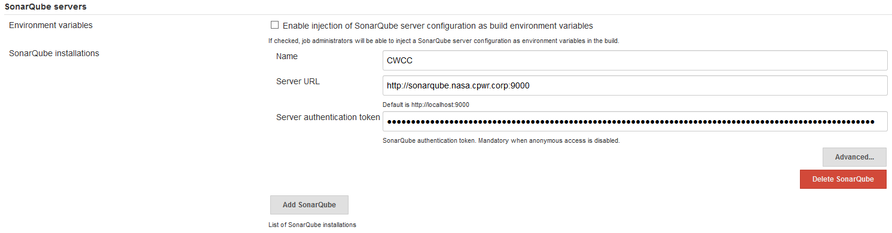

# SonarQube server information
In `Manage Jenkins` -> `Configure System`, under the heading **SonarQube servers** use the `Add SonarQube` button to add a new definition. Provide a `Name` to be used during the scripts, provide the URL to your SonarQube server and the SonarQube server access token for this server. Refer to your SonarQube administrator for required information.

