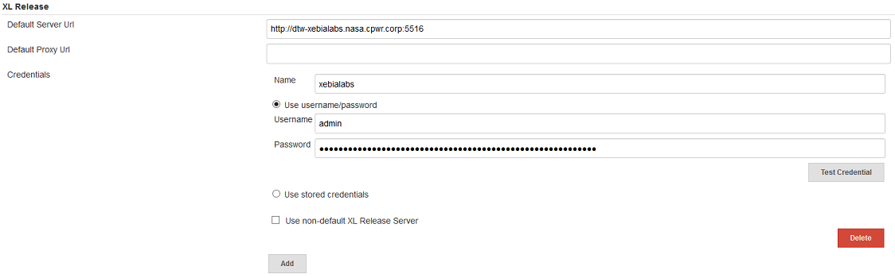

#  XL Release
In `Manage Jenkins` -> `Configure System`, under the heading **XL Release** use the `Add` button to add a new definition. Use `	Default Server Url` to point to your XL Release server, provide a `Name` to be used during the scripts and credentials to use for authentication.

